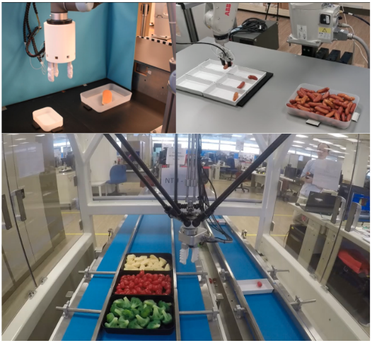
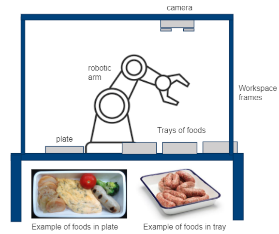
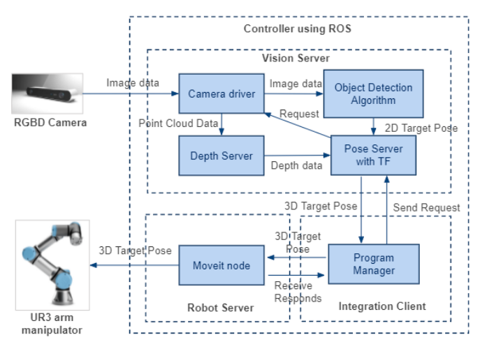

# Soft Hybrid Gripper Project - Phase 2

## Repository Description
This repository consists of the integrated software solution for Robot Food Assembly in the Phase 2 of the Soft Hybrid Gripper Project. ROS framework was used as middleware to capture inputs from [Astra depth camera](http://wiki.ros.org/astra_camera) and to control output of the [Universal Robot](https://github.com/UniversalRobots/Universal_Robots_ROS_Driver). Example of self-created package such as [pose server](https://github.com/tyseng92/Soft-Hybrid-Gripper/tree/main/pose_server) can be found in the root level of this repo. 

## Robotic Flow System 

## Robotic System Architecture

